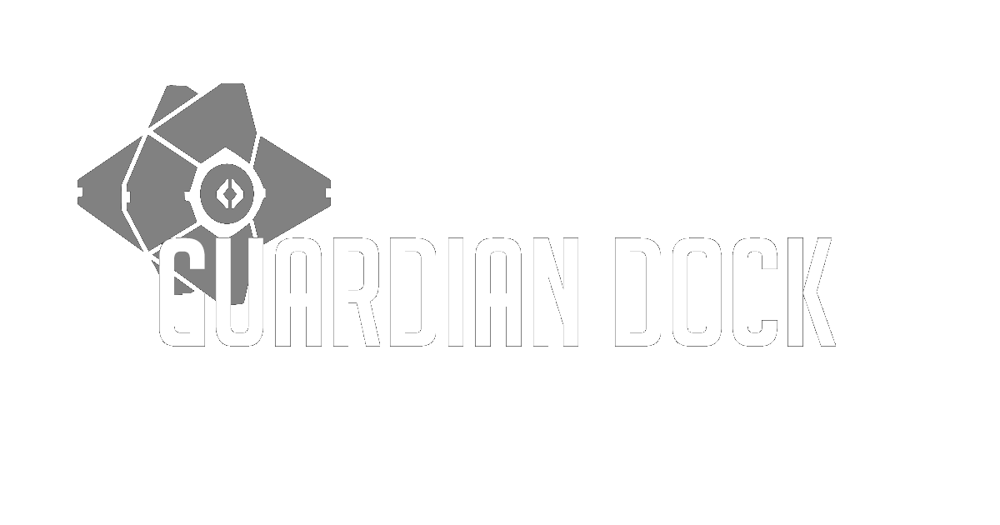

<h1 align="center">
  
    Destiny 2 Stat Tracker for the Guardians by the Guardians
</h1>

GuardianDock is an old project developed for the EPITECH school HUB module. This project aims to be a stat tracker for ***Call of Duty: Modern Warfare***, ***Fortnite*** and ***Destiny 2***. After the delivery, this project was abandoned and not touched anymore.

This project recast aims to renew the project updating frameworks, APIs and even languages.

At the moment, the project is developed with React Native TS but may change for NativeScripts TS (React Components).

### Important Notices

* ``master`` branch isn't up to date anymore. APIs don't even work anymore.
* This project is in development phase. It may take a will for it to be fully back.

### Features

GuardianDock is a Destiny 2 Stat Tracker. Using it, you can:

* Track any Destiny 2 profile stats *In development*
* Register your account to access it faster *In development*
* Know more things about the game *In development*

